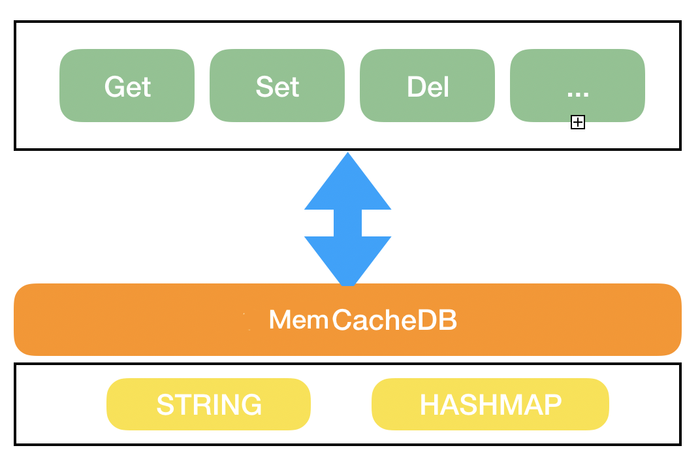
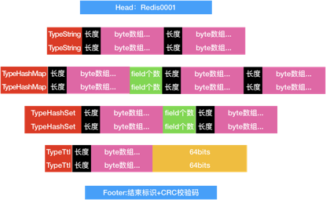

[TOC]
# mem-cache
## 已实现
- [x] 支持kv存储
- [x] 支持hmap存储
- [x] 支持落盘策略选择，修改策略后，不会影响已使用的代码
- [x] 支持API的拓展
- [x] 支持存储结果和返回值的拓展(借鉴go-redis和miniredis)
- [x] 支持Expire(单独一个map记录过期的绝对时间，删除策略仿redis)

## 后续功能
- [ ] 更多的落盘策略
- [ ] 多库
- [ ] 分片提升效率

# 系统架构

* API形式的函数调用，无论底层如何变化，保证上层API接口不变
* 借鉴go-redis client的形式，每个请求打包为一个Cmd，将结果写入和返回带有结果的Cmd，通过Result获取预期的格式
## 介绍
### 基础数据结构
* 见cache.go
* MemCache为缓存大类，持有一个读写锁，和缓存实体类RedisDB
* RedisDB在初始化时，需要初始化内部存储的内存结构，并注册各自对应的api底层函数
```
type str map[string]string
type hmap map[string]map[string]string
type RedisDB struct {
	//all keys
	keys map[string]ValueType
	ttl  map[string]time.Duration
	//Data Structure
	s  str
	hm hmap
	// internal function
	name2func map[string]Cmd
	// storage limit
	count     int
	msize     int
}
type SwitchCache struct {
	l         sync.RWMutex
	db        *RedisDB
}
```
### API层
* 定义在MemCache结构内，被外部直接调用
* 返回值风格和go-redis保持一致，为带有明确数据类型的XXResult结构
* 写入的操作使用写锁，读取的操作使用读锁
* 操作名称不区分大小写,GET和get是等价的
### 存储层
* 调用对应的底层api
    * 检查参数持否符合要求，同redis检查，具体见[支持接口]()
    * 调用前检查
        * 检查key是否已存在，如果已存在，是否和当前调用的是同一种数据类型，不一致则报错
        * ttl检查，此处进行类似懒加载的操作，检查当前key是否已超时，超时则当场删除
    * 存储数据到对应的数据结构
    * 给Result赋值，返回val或err
### 调用流程
* 在上层API中，根据调用，生成对应的底层IResult类
* 根据操作名称，在RedisDB中找到对应的函数，传入Result参数执行
* 底层api对Result类的val或err进行赋值
* 从Result类取出调用结果
## 支持的数据结构
### kv存储
* map[string]string
### hashmap存储
* map[string]map[string]string
### 过期策略
* 采用和redis一样的被动删除+定期删除的方式
    * 被动删除，当使用到key之前，先检查ttl，如果过期，则先删除
    * 定期删除，固定时间间隔，对ttl进行抽查，如果过期的超过25%则在删除后，再执行一遍抽查，直到过期key低于25%
## 拓展方案
### 新增数据结构
* 新建一个数据结构文件 t_xxx.go
* 定义数据结构，完成init初始化，在RedisDB中新增对应的数据结构，并调用初始化函数
* 由于del可以删除多种数据结构，每增加一个结构需要额外维护一下该方法
### 新增数据结构内的方法
* 编写底层api函数
    * 参数检查
    * 调用执行前通用检查（类型检查，ttl检查等）
    * 操作数据结构
    * 给Result赋值
* 底层api注册的时候，名称均为小写
### 新增初始化策略
* 主要是落盘方式等，对外来说是一个配置文件的改动，对内部来说，是修改NewSwitchCache的初始化逻辑，丰富策略选择
# 使用入门
* 和redis一样，同样的key在不同的数据结构中，不能重复
* del可以删除任何结构对应的key
## 支持接口
* Get
    * Get(key string) * BytesResult
    * 返回值1个byte数组
* Set
    * Set(key string, value []byte) *BoolResult
    * 返回bool值
* Del
    * Del(keys... string) *IntResult
    * 返回删除成功的个数
* Expire
    * Expire(keys string, seconds int) *IntResult
    * key存在设置成功，返回1，key不存在返回0
* HGet
    * HGet(key, field string) *BytesResult
    * 返回1个byte数组
* HSet
    * HSet(key, field string, value []byte) *IntResult
    * field不存在返回1并新增，field存在返回0并覆盖，用来区分是否覆盖
* HDel
    * HDel(key string, field... string) *IntResult
    * 返回删除成功的个数
* SAdd
    * SAdd(key string, members ...string) *IntResult
    * member不存在返回新增的个数，member存在，不做处理不计数，用来区分是否覆盖
* SIsMember
    * SIsMember(key string, member string) *IntResult
    * 存在返回1，不存在返回0
## 调用示例
```
    cache, err := NewSwitchCache(&CacheConf{
        MaxSize:10,
        TtlPeriodMillSecond: 500,
    })
    if err != nil {
        异常处理
    }
    res, err := cache.Set("test2", "1").Result()
```

# 数据落盘

## 落盘策略

* 每30秒触发一次落盘逻辑，如果30秒内缓存进行过超过storageOperateLimit次数的操作则进行落盘操作，默认值为1000，可以在启动时传入
* 落盘时，落盘ttl, kv, hashmap， hashset。
* 恢复时，根据读出的数据，调用实际对应的API，进行正常的插入操作恢复整个缓存

## 存储方式

* 将整个库的数据转为byte进行存储，大体思路为1 byte标注后续的数据类型，然后根据此类型进入不同的读取方法
* 存储开头为REDIS%04d 整数为版本号，默认1
* 结尾为 结束标识符+之前错有数据的CRC校验码，可用来验证数据的完整性
* 具体设计见wiki文档

 

## 设计细节

**整型**

统一转换为int64，采用bigEndian存储


**浮点型**

统一转换为float64，采用bigEndian存储


**byte****数****组****(****字符串****)**

长度+byte数组


**TTL**

map[string]time.Time

每个键值对分别存储，1位byte标识为TypeTtl，1个byte数组，1个时间戳浮点型


**KV**

str map[string][]byte

每个键值对分别存储，1位byte标识为TypeString，1个byte数组，1个byte数组


**HashMap**

map[string]map[string][]byte

每个key分别存储，1位byte标识为TypeHash，1个field个数(n)，n个(1个byte数组，1个byte数组)


**HashSet**

map[string]map[string]float64

每个key对分别存储，1位byte标识为TypeSet，1个field个数(n)，n个byte数组，没有存float64，改字段为给zset预留的


## 存储编码流程

1.   存储文件头，为Redis+4位版本号

2.   存储KV

3.   存储HashMap

4.   存储HashSet

5.   存储Ttl，一定要最后存储ttl，因为再恢复缓存的时候，只有在key已存在的时候，才能成功设置ttl



## crc校验

将已经存储的字节流在写入的同时，记录CRC校验吗，放在落盘文件的末尾。恢复的时候，可以直接根据文件和CRC校验码校验文件的合法性

读取解码流程

1.校验Header

循环--------------------------------------------------

读取1位byte

  如果byte是结束符结束读取

  如果是其他标识 Flag

​    首先读取一个字符串，这个字符串一定是key，根据Flag类型，进行其他类型的读取

​        TypeTtl 读取一个浮点数，将key-浮点数插入到缓存的ttl

​        TypeString 读取一个字符串，将key-字符串插入到缓存的KV

​        TypeHashMap 读取field长度n，和n组field-value，并将n个key-field-value插入到缓存的HashMap

​        TypeHashSet 读取field长度n，和n组member，并将n个key-member插入到缓存的HashSet

循环结束-----------------------------------------------

 